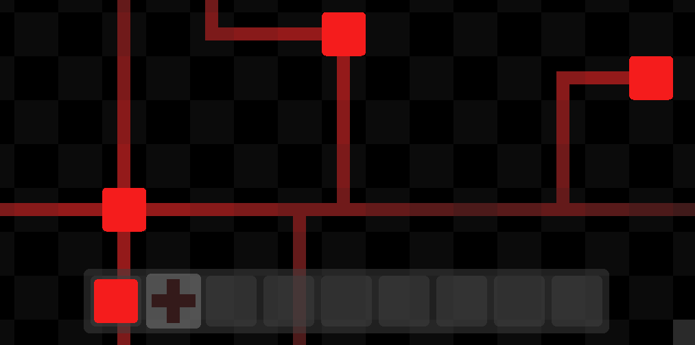

# C Raylib Games

Just some games I made with C using Raylib.

## Pistonsim

Logic simulation inspired by Minecraft's redstone.



See more info at it's [`README.md`](./pistonsim/README.md) file.

Here's the `cloc` command output on the source code:

```
-------------------------------------------------------------------------------
Language                     files          blank        comment           code
-------------------------------------------------------------------------------
C                                4             74              0            348
C/C++ Header                     3             15              0             46
make                             1             10              0             22
Markdown                         1              4              0              9
-------------------------------------------------------------------------------
SUM:                             9            103              0            425
-------------------------------------------------------------------------------
```

One of the larger projects I have worked on so far.

## Memory

The typical card memory game. Although, this version just uses colors, no icons here.


Here's the `cloc` command output on the source code:

```
-------------------------------------------------------------------------------
Language                     files          blank        comment           code
-------------------------------------------------------------------------------
C                                1             50             21            207
make                             1              0              0              2
-------------------------------------------------------------------------------
SUM:                             2             50             21            209
-------------------------------------------------------------------------------
```

Compile it using the `Makefile`.

## Puzimg

A game where you assemble an image! Here's what it looks like:


And here's what it looks like when you assemble it correctly:


Here's the `cloc` command output on the source code:

```
-------------------------------------------------------------------------------
Language                     files          blank        comment           code
-------------------------------------------------------------------------------
C                                2             45              0            231
-------------------------------------------------------------------------------
SUM:                             2             45              0            231
-------------------------------------------------------------------------------
```

Compile it with this command:

```shell
$ cc ./puzimg/main.c -l raylib
```